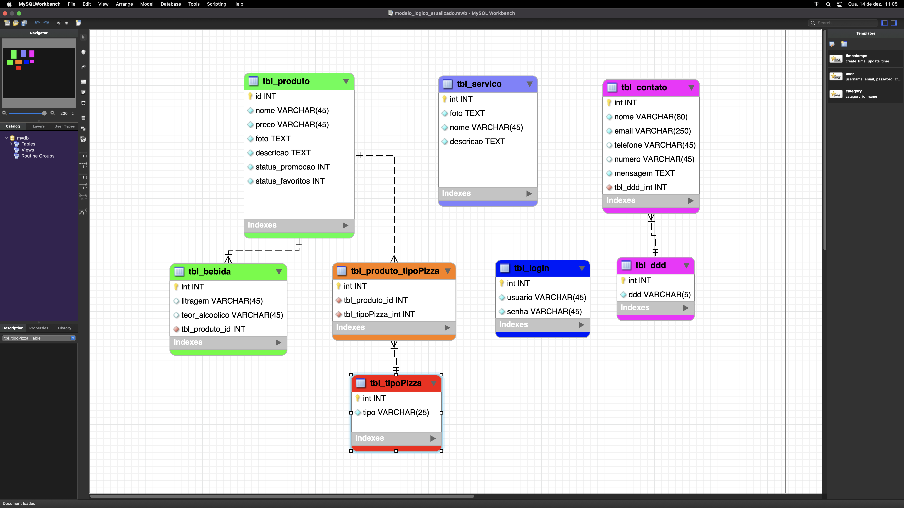

# Pizzaria LaPizza

LEONARDO BARBOSA SANTOS
EDUARDO PERUCCI MARTINS DE SOUZA

### Objetivo

Este projeto tem como objetivo criar uma pizzaria, ele possuindo o banco de dados, o back-end e o front-end

### Tecnologias Utilizadas

 

  

           

### Banco de Dados

   

### Back-end

O Back-End foi utilizado com as ferramentas NODE e PRISMAS com o objetivo de linkar com o Banco de Dados MYSQL, sendo assim, possivel de se fazer a estrutura de codigos.

1. <a href="https://github.com/peruccii/lalapizza">Back-End</a>

### Front-end

O site utilizou as linguagens de marcação HTML para estruturação e CSS para estilização, porém tambem foi utilizado o JS, para permitir interligar o Front-End com o Back-End, além disso foi utilizado para deixar a pagina mais dinámica 

1. <a href="https://www.figma.com/file/fsN6SzrnXr39cX10lJn8Cv/LaPizza-project?node-id=0%3A1&t=BOoTyYfkm2d4hP1O-1"> Figma</a>

2. <a href="https://github.com/peruccii/front-pizzaria">Front-End</a>

3. <a href="https://peruccii.github.io/front-pizzaria/">Site</a>

